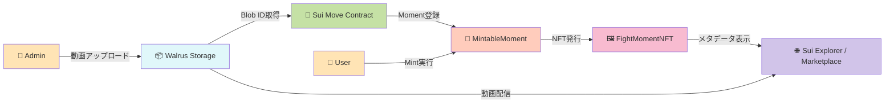
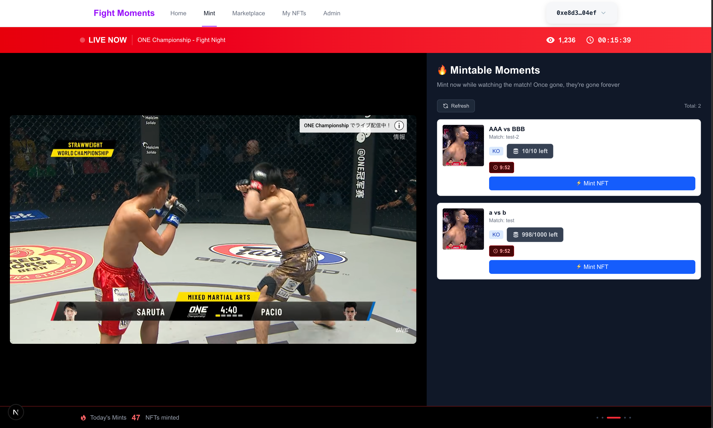
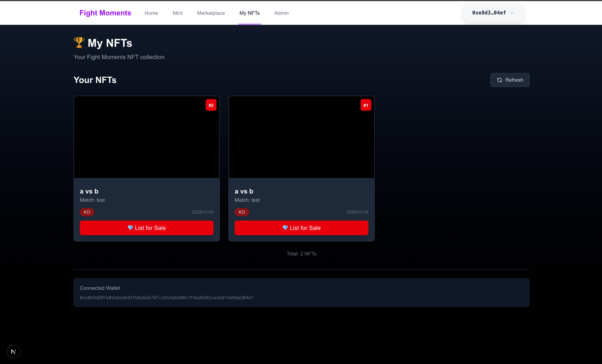
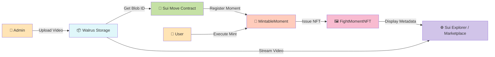

# 🥊 Fight Moments

> **試合をリアルタイムで見ないと手に入らない、決定的瞬間のNFT**
> ライブ配信視聴に革新的なインセンティブを創出

[](https://sui.io/)
[](https://docs.walrus.site/)
[](https://nextjs.org/)
[](https://www.typescriptlang.org/)
[](https://opensource.org/licenses/MIT)

**🏆 Sui × ONE Championship Hackathon Submission**

---

## 📺 デモ

[](https://youtu.be/FnLvfVf7y44)

📺 **[デモ動画を見る](https://youtu.be/FnLvfVf7y44)** - 1分30秒のウォークスルー

🌐 **ライブデモ**: https://fight-moments.pages.dev/
📦 **Smart Contract**: [View on Suiscan](https://suiscan.xyz/testnet/object/0xcb62132563f5a2a606950ae6417665d80fb06048bb2eb832618b5ee0376f4401)

---

## 🌟 プロジェクトハイライト

### 💰 解決する課題

**格闘技ライブ配信の最大の課題：「後でアーカイブで見れば良い」**

現状のスポーツライブ配信には以下の深刻な課題があります：

- ❌ **リアルタイム視聴の動機づけ不足**：見逃しても後でアーカイブで見れば良い、という心理が働き、**ライブ配信の価値が著しく低下**
- ❌ 配信プラットフォームに動画が閉じ込められている
- ❌ ファンが「自分が見たあの瞬間」を公式に所有できない
- ❌ 選手や主催団体への二次的収益還元が不十分

### 🎯 Fight Moments NFTの解決策

**「今見ないと手に入らない」— リアルタイム視聴に革新的インセンティブを創出**

| 特徴 | 説明 |
|------|------|
| ⚡ **リアルタイムMint** | 試合中の注目シーンを公式が即座に登録、ライブ視聴者だけがMint可能 |
| 🎬 **Walrus分散ストレージ** | 動画を永続的に保存、中央サーバーに依存しない |
| ⛓️ **Sui所有権証明** | ブロックチェーンで所有権を透明に管理 |
| 🎫 **限定発行 + シリアル番号** | オンチェーンSupply管理で希少価値を担保 |
| 💸 **二次流通対応** | Marketplaceでファン間の取引が可能 |

### 💡 ライブ視聴の動機づけ — 本プロジェクトの核心価値

**リアルタイムMintがスポーツライブ配信に革命をもたらす理由**

従来の配信モデルでは、ファンは「後でアーカイブで見ればいい」と考え、ライブ視聴率が低迷。
本プロジェクトは、**試合中の数分間だけMint可能な限定NFT**により、この課題を根本から解決します。

#### 🎯 4つの心理的インセンティブ

1. **⏰ 時間的希少性**
   - 試合中の決定的瞬間発生 → 公式が即座に登録 → **数分間だけMint可能**
   - 見逃したら**二度と初回発行権は手に入らない**
   - アーカイブ視聴者は二次市場でしか入手不可（高額化の可能性）

2. **🎫 その場にいた証明**
   - 歴史的瞬間を「目撃した証人」としてのNFT
   - タイムスタンプとシリアルナンバーで立ち会った証拠を永久保存
   - コレクターズアイテムとしての価値

3. **🏆 先着順競争**
   - 限定100人など、供給数を厳しく制限
   - 早くMintするほど若いシリアルナンバー（#1, #2...）
   - コミュニティ内でのステータス獲得

4. **📈 投資価値**
   - リアルタイム参加者のみが持つ希少NFT → 高い二次流通価値
   - 伝説的試合のNFTは将来的に高値取引の可能性
   - ファン活動と投資を両立

#### 📊 ビジネスインパクト

- **PPV購入動機**: NFTを手に入れるために、ライブ配信を購入
- **広告価値向上**: リアルタイム視聴者数の増加 → 広告単価UP
- **コミュニティ活性化**: NFT保有者限定イベントなど、エンゲージメント施策の基盤
- **選手・団体収益**: 二次流通ロイヤリティで継続的収益

→ ### **「後でアーカイブで見ればいい」から「今見ないと絶対損する」へ**

### ⚡ 技術的革新性

- ✅ **リアルタイムMint**: 試合中の決定的瞬間を即座にNFT化、ライブ視聴者限定Mint
- ✅ **Walrus × Sui統合**: 動画NFTの実用的実装を実現
- ✅ **Supply管理**: オンチェーン希少性制御（max_supply設定）
- ✅ **Display最適化**: Sui Explorer完全対応（HTTPS URL修正済み）
- ✅ **Admin権限制御**: AdminCapによる品質保証された登録フロー

---

## 🏆 Sui × ONE Championship ハッカソンへの適合性

### ONE Championshipへの革新的価値提案

**本プロジェクトの最大の価値:ライブ配信視聴率の飛躍的向上**

格闘技興行において、**ライブ配信視聴者数**はビジネスの生命線です。
Fight Moments NFTは、リアルタイムMintにより、この最重要KPIに直接インパクトを与えます。

| ONE Championshipの課題/価値 | Fight Moments NFTで実現 |
|------------------------|------------------------|
| 📺 **ライブ視聴率の最大化** 🔥 | **試合中にしかMintできない限定NFT**で「今見ないと損する」心理を創出 → PPV購入・視聴者数が劇的に向上 |
| ⚡ **瞬間のドラマを資産化** | KO・一本などの決定的瞬間を永続化、ファンが所有可能 |
| 🌏 **グローバルファンベース** | 世界中のファンが同時刻に同じNFTを奪い合う、国境を超えた一体感 |
| 🎖️ **アスリート価値の最大化** | 選手の名シーンがファン資産として流通、選手のブランド価値向上 |
| 📈 **新収益モデル構築** | 二次流通ロイヤリティで継続的収益、NFT保有者限定コンテンツ等の展開 |

### Sui Networkの技術優位性

| Sui特性 | 本プロジェクトでの活用 |
|---------|----------------------|
| ⚡ **高速トランザクション** | 試合中のリアルタイムMintに必須、Mint処理が即座に完了 |
| 💰 **低コスト** | ライブ視聴中のファンが気軽に複数Mint可能 |
| 🎨 **豊富なDisplay機能** | NFTメタデータの柔軟な表示 |
| 🔧 **Move言語の安全性** | Supply制御やAdmin権限を厳密に実装 |

### ハッカソンテーマ該当性

- ✅ **DeFi/NFT活用**: NFT Marketplace + ロイヤリティ分配
- ✅ **Infrastructure**: Walrus分散ストレージ統合
- ✅ **Gaming/Entertainment**: スポーツエンタメ × ファンエンゲージメント
- ✅ **Sui技術の最大活用**: Move 2024.beta + Display + Kiosk

---

## 🏗️ システムアーキテクチャ



### コア設計原則

- **分離責任**: ストレージ（Walrus） / 所有権（Sui） / UI（Next.js）
- **Admin権限制御**: AdminCapによる公式Moment登録制限
- **Supply管理**: max_supply制約による希少性保証
- **永続性**: Walrus分散ストレージで動画データを永久保存

---

## 🛠️ 技術スタック

### Blockchain & Storage
| 技術 | 用途 | バージョン |
|------|------|-----------|
| **Sui Move** | スマートコントラクト | 2024.beta edition |
| **Walrus** | 分散動画ストレージ | Testnet |
| **@mysten/dapp-kit** | Sui Wallet統合 | Latest |

### Frontend
| 技術 | 用途 | バージョン |
|------|------|-----------|
| **Next.js** | フロントエンドフレームワーク | 16.x (App Router) |
| **React** | UIライブラリ | 19.x |
| **TypeScript** | 型安全性 | 5.x |
| **Tailwind CSS** | スタイリング | v4 |
| **Biome** | Lint/Format | Latest |

---

## ✨ 主要機能

### 1. 🎬 Moment登録（Admin専用）

**試合中の注目シーンをリアルタイムで登録**

格闘技の試合中、KO・一本・判定などの決定的瞬間が起きた直後、公式管理者が即座に以下の操作を実行：

- 📹 注目シーンの動画ファイルをWalrusへアップロード
- 🔗 Blob IDを取得してMove Contractへ登録
- ⚙️ Moment情報設定（タイトル、説明、最大発行数）
- ⚡ **試合中継を見ているファンだけが即座にMint可能な状態に**

```typescript
// Adminのみ実行可能（AdminCap保有者）
register_mintable_moment(
  admin_cap: &AdminCap,
  title: String,
  description: String,
  media_url: String,  // Walrus Blob URL
  max_supply: u64,    // 最大発行数
  ctx: &mut TxContext
)
```

### 2. 🎫 NFT Mint（ユーザー）

**試合をライブ視聴しているファンだけが即座にMint可能**

リアルタイムでの価値：
- ⚡ 試合中の決定的瞬間発生 → 公式が即座に登録 → **その瞬間を見ていた人だけが限定NFTをMint**
- 🎫 先着順で限定数のみ発行（例: 最初の100人だけ）
- 🏆 ライブ視聴者特典として、その場に"いた"証明となる希少なNFT

Mintフロー：
- 登録されたMoment一覧から選択
- Mintボタンクリックでトランザクション実行
- シリアルナンバー付きNFT取得（例: #3/10）

```typescript
// 誰でもMint可能（Supply上限まで）
mint_moment(
  mintable: &mut MintableMoment,
  payment: Coin<SUI>,
  ctx: &mut TxContext
): FightMomentNFT
```

### 3. 📊 Supply管理

**オンチェーン希少性制御**

- 各Momentに最大発行数（max_supply）を設定
- 現在のMint数をトラッキング
- 上限到達後はMint不可（フロントでも表示）

### 4. 🔄 Marketplace

**NFTの二次流通**

- 発行済みNFT一覧表示
- Sui Kiosk経由での取引
- Transfer Policy適用（ロイヤリティ設定済み）

---

## 🚀 デプロイ情報

### Sui Testnet

| 項目 | 値 |
|------|-----|
| **Network** | Sui Testnet |
| **Package ID** | `0xcb62132563f5a2a606950ae6417665d80fb06048bb2eb832618b5ee0376f4401` |
| **Transfer Policy** | `0x5a9a3cf651d84104178b2d3ebc415d7f9c9d249d9969f083a2e3da88b17fe3a7` |
| **Admin Cap** | `0x97bb2c72fc4fda471b84dd606fa38534a3f017f28a5b1525017a9ff0e0d70b83` |
| **Collection ID** | `fight-moments-v1` |

### Walrus Testnet

| 項目 | 値 |
|------|-----|
| **Publisher URL** | `https://publisher.walrus-testnet.walrus.space` |
| **Aggregator URL** | `https://aggregator.walrus-testnet.walrus.space` |

### Frontend Deployment

- **Platform**: Cloudflare Pages
- **URL**: https://fight-moments.pages.dev/

---

## 💡 技術的チャレンジと解決策

### 1. 🎥 動画の永続化問題

**課題**: 中央集権的ストレージ（AWS S3, YouTube等）への依存

**解決策**:
- Walrus分散ストレージへの統合実装
- Blob IDをオンチェーンで管理
- Walrus Aggregator経由で動画配信

```typescript
// Walrus Blob URL形式
https://aggregator.walrus-testnet.walrus.space/v1/{blob_id}
```

### 2. 🖼️ NFTメタデータの柔軟性

**課題**: Sui ExplorerでのNFT表示URL形式問題

**解決策**:
- Display設定でHTTPS URLを指定
- image_url/media_url両方に対応
- 最近のコミットで修正完了（`b0d61a7`）

```move
// Display設定（Move Contract）
display.add(b"image_url", b"https://aggregator.walrus-testnet.walrus.space/v1/{media_url}");
```

### 3. ⚙️ Supply管理の信頼性

**課題**: NFT発行数の上限制御をオンチェーンで実現

**解決策**:
- MintableMoment構造体でcurrent_supply/max_supplyを管理
- Mint時にassert!で上限チェック
- フロントエンドでも進捗表示（5/10 Mintedなど）

---

## 🎬 デモ動画撮影について

> 📹 **撮影台本**: [`docs/DEMO_SCRIPT.md`](./docs/DEMO_SCRIPT.md)

デモ動画を作成される場合は、上記の台本を参考にしてください。
推奨時間: **1分30秒**

---

## 📁 リポジトリ構成

```
fight_moments/
├── contracts/              # Sui Move スマートコントラクト
│   ├── sources/
│   │   └── contracts.move  # FightMomentNFT, MintableMoment定義
│   ├── Move.toml
│   └── Move.lock
├── frontend/               # Next.js フロントエンド
│   ├── src/
│   │   ├── app/           # App Router（pages）
│   │   ├── components/    # React Components
│   │   ├── lib/           # Utilities, Constants
│   │   └── hooks/         # Custom Hooks
│   ├── public/
│   ├── package.json
│   ├── .env.example       # 環境変数サンプル
│   └── biome.json         # Linter設定
├── docs/                  # ドキュメント
│   ├── screenshots/       # スクリーンショット用
│   │   └── README.md      # 撮影ガイド
│   └── DEMO_SCRIPT.md     # デモ動画台本
└── README.md              # 本ドキュメント
```

---

## 📸 スクリーンショット

<!-- ※ Landing PageとMarketplaceのスクリーンショットは実装中です -->
<!--
### Landing Page

-->

### Mint画面


### NFT詳細（Walrus動画再生）


<!--
### Marketplace

-->

> 📸 **スクリーンショット撮影ガイド**: [`docs/screenshots/README.md`](./docs/screenshots/README.md)

---

<div align="center">

**🥊 Fight Moments NFT - Own the Moment, Forever 🥊**

Made with ❤️ for Sui × ONE Championship Hackathon

</div>

---
---

# 🥊 Fight Moments (English)

> **Exclusive NFTs of Decisive Moments - Only Available During Live Viewing**
> Creating Revolutionary Incentives for Live Stream Engagement

[](https://sui.io/)
[](https://docs.walrus.site/)
[](https://nextjs.org/)
[](https://www.typescriptlang.org/)
[](https://opensource.org/licenses/MIT)

**🏆 Sui × ONE Championship Hackathon Submission**

---

## 📺 Demo

[](https://youtu.be/FnLvfVf7y44)

📺 **[Watch Demo Video](https://youtu.be/FnLvfVf7y44)** - 1m30s Walkthrough

🌐 **Live Demo**: https://fight-moments.pages.dev/
📦 **Smart Contract**: [View on Suiscan](https://suiscan.xyz/testnet/object/0xcb62132563f5a2a606950ae6417665d80fb06048bb2eb832618b5ee0376f4401)

---

## 🌟 Project Highlights

### 💰 Problem We're Solving

**The Biggest Challenge in Combat Sports Live Streaming: "I'll just watch the archive later"**

Current sports live streaming faces critical issues:

- ❌ **Lack of Real-time Viewing Motivation**: The mindset of "I can watch the archive later" **significantly devalues live streaming**
- ❌ Videos locked into centralized platforms
- ❌ Fans cannot officially own "that moment they witnessed"
- ❌ Insufficient secondary revenue return to athletes and organizers

### 🎯 Fight Moments NFT Solution

**"Watch Now or Miss Out Forever" — Creating Revolutionary Live Viewing Incentives**

| Feature | Description |
|---------|-------------|
| ⚡ **Real-time Mint** | Officials instantly register key moments during matches; only live viewers can mint |
| 🎬 **Walrus Decentralized Storage** | Videos stored permanently, no central server dependency |
| ⛓️ **Sui Ownership Proof** | Transparent blockchain-based ownership management |
| 🎫 **Limited Supply + Serial Numbers** | On-chain supply management ensures scarcity value |
| 💸 **Secondary Market Ready** | Fan-to-fan trading via Marketplace |

### 💡 Live Viewing Motivation — Core Value Proposition

**How Real-time Minting Revolutionizes Sports Live Streaming**

Traditional streaming models suffer from low live viewership because fans think "I'll watch the archive later."
This project fundamentally solves this by offering **limited-time NFTs mintable only during the match**.

#### 🎯 Four Psychological Incentives

1. **⏰ Time Scarcity (FOMO)**
   - Decisive moment happens → Official registers instantly → **Mintable for only a few minutes**
   - Miss it and **you'll never get primary issuance rights again**
   - Archive viewers can only acquire through secondary market (potentially at premium prices)

2. **🎫 Proof of Presence**
   - NFT as witness certificate of historic moments
   - Timestamp and serial number as permanent proof of attendance
   - Collector's item value

3. **🏆 First-Come Competition**
   - Strict supply limits (e.g., limited to 100 people)
   - Earlier mints get lower serial numbers (#1, #2...)
   - Community status acquisition

4. **📈 Investment Value**
   - Rare NFTs exclusive to real-time participants → High secondary market value
   - Legendary match NFTs may trade at premium prices in the future
   - Combines fan activity with investment

#### 📊 Business Impact

- **PPV Purchase Motivation**: Fans buy live stream access to obtain NFTs
- **Advertising Value Increase**: Higher live viewer count → Higher ad rates
- **Community Activation**: Foundation for engagement initiatives like NFT holder-exclusive events
- **Athlete/Organizer Revenue**: Continuous revenue through secondary market royalties

→ ### **From "I'll watch the archive later" to "Must watch now or lose forever"**

### ⚡ Technical Innovation

- ✅ **Real-time Mint**: Instantly NFT-ify decisive moments during matches; live viewer exclusive minting
- ✅ **Walrus × Sui Integration**: Practical implementation of video NFTs
- ✅ **Supply Management**: On-chain scarcity control (max_supply setting)
- ✅ **Display Optimization**: Full Sui Explorer compatibility (HTTPS URL fixed)
- ✅ **Admin Authorization**: Quality-assured registration flow via AdminCap

---

## 🏆 Sui × ONE Championship Hackathon Fit

### Innovative Value Proposition for ONE Championship

**The Greatest Value of This Project: Dramatic Live Streaming Viewership Increase**

For combat sports events, **live streaming viewer count** is the business lifeline.
Fight Moments NFT directly impacts this crucial KPI through real-time minting.

| ONE Championship Challenge/Value | Realized by Fight Moments NFT |
|---------------------------------|------------------------------|
| 📺 **Maximize Live Viewership** 🔥 | **Limited NFTs mintable only during matches** create "watch now or lose out" psychology → Dramatic PPV purchases and viewer increase |
| ⚡ **Monetize Dramatic Moments** | Perpetuate decisive moments like KOs and submissions; fans can own them |
| 🌏 **Global Fan Base** | Worldwide fans compete for same NFTs simultaneously; cross-border unity |
| 🎖️ **Maximize Athlete Value** | Athletes' iconic moments circulate as fan assets; enhances athlete brand value |
| 📈 **Build New Revenue Model** | Continuous revenue through secondary market royalties; NFT holder-exclusive content, etc. |

### Sui Network Technical Advantages

| Sui Feature | Utilized in This Project |
|-------------|-------------------------|
| ⚡ **High-speed Transactions** | Essential for real-time minting during matches; instant mint processing |
| 💰 **Low Cost** | Live viewers can casually mint multiple NFTs |
| 🎨 **Rich Display Features** | Flexible NFT metadata display |
| 🔧 **Move Language Safety** | Strict implementation of supply control and admin authorization |

### Hackathon Theme Alignment

- ✅ **DeFi/NFT Utilization**: NFT Marketplace + Royalty Distribution
- ✅ **Infrastructure**: Walrus Distributed Storage Integration
- ✅ **Gaming/Entertainment**: Sports Entertainment × Fan Engagement
- ✅ **Maximum Sui Tech Utilization**: Move 2024.beta + Display + Kiosk

---

## 🏗️ System Architecture



### Core Design Principles

- **Separation of Concerns**: Storage (Walrus) / Ownership (Sui) / UI (Next.js)
- **Admin Authorization Control**: Official Moment registration restricted via AdminCap
- **Supply Management**: Scarcity guarantee through max_supply constraints
- **Permanence**: Videos stored permanently on Walrus distributed storage

---

## 🛠️ Tech Stack

### Blockchain & Storage
| Technology | Purpose | Version |
|------------|---------|---------|
| **Sui Move** | Smart Contracts | 2024.beta edition |
| **Walrus** | Decentralized Video Storage | Testnet |
| **@mysten/dapp-kit** | Sui Wallet Integration | Latest |

### Frontend
| Technology | Purpose | Version |
|------------|---------|---------|
| **Next.js** | Frontend Framework | 16.x (App Router) |
| **React** | UI Library | 19.x |
| **TypeScript** | Type Safety | 5.x |
| **Tailwind CSS** | Styling | v4 |
| **Biome** | Lint/Format | Latest |

---

## ✨ Key Features

### 1. 🎬 Moment Registration (Admin Only)

**Register Key Moments in Real-time During Matches**

During combat sports matches, immediately after decisive moments like KOs, submissions, or decisions, official administrators execute:

- 📹 Upload key moment video file to Walrus
- 🔗 Obtain Blob ID and register to Move Contract
- ⚙️ Configure Moment info (title, description, max supply)
- ⚡ **Only fans watching the live broadcast can mint immediately**

```typescript
// Only Admin can execute (AdminCap holder)
register_mintable_moment(
  admin_cap: &AdminCap,
  title: String,
  description: String,
  media_url: String,  // Walrus Blob URL
  max_supply: u64,    // Maximum supply
  ctx: &mut TxContext
)
```

### 2. 🎫 NFT Mint (User)

**Only fans watching live can mint immediately**

Real-time value:
- ⚡ Decisive moment happens → Official registers instantly → **Only those watching that moment can mint limited NFTs**
- 🎫 Limited quantity issued on first-come basis (e.g., first 100 people only)
- 🏆 Live viewer privilege; rare NFT proving you "were there"

Mint Flow:
- Select from registered Moment list
- Click Mint button to execute transaction
- Receive NFT with serial number (e.g., #3/10)

```typescript
// Anyone can mint (up to supply limit)
mint_moment(
  mintable: &mut MintableMoment,
  payment: Coin<SUI>,
  ctx: &mut TxContext
): FightMomentNFT
```

### 3. 📊 Supply Management

**On-chain Scarcity Control**

- Set maximum supply (max_supply) for each Moment
- Track current mint count
- Minting disabled after limit reached (displayed on frontend)

### 4. 🔄 Marketplace

**NFT Secondary Market**

- Display issued NFT list
- Trading via Sui Kiosk
- Transfer Policy applied (royalty configured)

---

## 🚀 Deployment Information

### Sui Testnet

| Item | Value |
|------|-------|
| **Network** | Sui Testnet |
| **Package ID** | `0xcb62132563f5a2a606950ae6417665d80fb06048bb2eb832618b5ee0376f4401` |
| **Transfer Policy** | `0x5a9a3cf651d84104178b2d3ebc415d7f9c9d249d9969f083a2e3da88b17fe3a7` |
| **Admin Cap** | `0x97bb2c72fc4fda471b84dd606fa38534a3f017f28a5b1525017a9ff0e0d70b83` |
| **Collection ID** | `fight-moments-v1` |

### Walrus Testnet

| Item | Value |
|------|-------|
| **Publisher URL** | `https://publisher.walrus-testnet.walrus.space` |
| **Aggregator URL** | `https://aggregator.walrus-testnet.walrus.space` |

### Frontend Deployment

- **Platform**: Cloudflare Pages
- **URL**: https://fight-moments.pages.dev/

---

## 💡 Technical Challenges & Solutions

### 1. 🎥 Video Permanence Problem

**Challenge**: Dependency on centralized storage (AWS S3, YouTube, etc.)

**Solution**:
- Integration with Walrus distributed storage
- Manage Blob ID on-chain
- Video streaming via Walrus Aggregator

```typescript
// Walrus Blob URL format
https://aggregator.walrus-testnet.walrus.space/v1/{blob_id}
```

### 2. 🖼️ NFT Metadata Flexibility

**Challenge**: NFT display URL format issues in Sui Explorer

**Solution**:
- Specify HTTPS URL in Display settings
- Support both image_url and media_url
- Fixed in recent commit (`b0d61a7`)

```move
// Display settings (Move Contract)
display.add(b"image_url", b"https://aggregator.walrus-testnet.walrus.space/v1/{media_url}");
```

### 3. ⚙️ Supply Management Reliability

**Challenge**: Implement NFT issuance cap control on-chain

**Solution**:
- Manage current_supply/max_supply in MintableMoment struct
- Cap check with assert! during mint
- Frontend also displays progress (5/10 Minted, etc.)

---

## 🎬 About Demo Video

> 📹 **Recording Script**: [`docs/DEMO_SCRIPT.md`](./docs/DEMO_SCRIPT.md)

If creating a demo video, please refer to the script above.
Recommended duration: **1m30s**

---

## 📁 Repository Structure

```
fight_moments/
├── contracts/              # Sui Move Smart Contracts
│   ├── sources/
│   │   └── contracts.move  # FightMomentNFT, MintableMoment definitions
│   ├── Move.toml
│   └── Move.lock
├── frontend/               # Next.js Frontend
│   ├── src/
│   │   ├── app/           # App Router (pages)
│   │   ├── components/    # React Components
│   │   ├── lib/           # Utilities, Constants
│   │   └── hooks/         # Custom Hooks
│   ├── public/
│   ├── package.json
│   ├── .env.example       # Environment variables sample
│   └── biome.json         # Linter config
├── docs/                  # Documentation
│   ├── screenshots/       # For screenshots
│   │   └── README.md      # Recording guide
│   └── DEMO_SCRIPT.md     # Demo video script
└── README.md              # This document
```

---

## 📸 Screenshots

<!-- ※ Landing Page and Marketplace screenshots are in progress -->
<!--
### Landing Page

-->

### Mint Screen


### NFT Detail (Walrus Video Playback)


<!--
### Marketplace

-->

> 📸 **Screenshot Guide**: [`docs/screenshots/README.md`](./docs/screenshots/README.md)

---

<div align="center">

**🥊 Fight Moments NFT - Own the Moment, Forever 🥊**

Made with ❤️ for Sui × ONE Championship Hackathon

</div>
