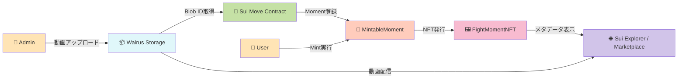

# 🥊 Fight Moments

> **試合をリアルタイムで見ないと手に入らない、決定的瞬間のNFT**
> ライブ配信視聴に革新的なインセンティブを創出

**🏆 Sui × ONE Championship Hackathon Submission**

---

## 📺 デモ

📺 **[デモ動画を見る](https://youtu.be/FnLvfVf7y44)** - 1分30秒のウォークスルー

🌐 **ライブデモ**: https://fight-moments.pages.dev/
📦 **Smart Contract**: [View on Suiscan](https://suiscan.xyz/testnet/object/0xcb62132563f5a2a606950ae6417665d80fb06048bb2eb832618b5ee0376f4401)

---

## 🌟 プロジェクトハイライト
## 🌟 Project Highlights

### 💰 解決する課題
**💰 Problem We're Solving**

**格闘技ライブ配信の最大の課題：「後でアーカイブで見れば良い」**
**The biggest challenge in combat sports live streaming: "I'll just watch the archive later."**

現状のスポーツライブ配信には以下の深刻な課題があります：
Current sports live streaming faces the following critical issues:

- ❌ **リアルタイム視聴の動機づけ不足**：見逃しても後でアーカイブで見れば良い、という心理が働き、**ライブ配信の価値が著しく低下**
  **Lack of real-time viewing motivation**: The mindset of "I can just watch the archive later" **severely devalues live streaming.**
- ❌ 配信プラットフォームに動画が閉じ込められている
  Videos are locked into centralized platforms.
- ❌ ファンが「自分が見たあの瞬間」を公式に所有できない
  Fans cannot officially own "that decisive moment they witnessed."
- ❌ 選手や主催団体への二次的収益還元が不十分
  Insufficient secondary revenue return to athletes and organizers.

### 🎯 Fight Moments NFTの解決策
**🎯 Fight Moments NFT Solution**

**「今見ないと手に入らない」— リアルタイム視聴に革新的インセンティブを創出**
**"Watch now or miss out forever" — creating revolutionary incentives for real-time viewing.**

| 特徴 | 説明 |
|------|------|
| ⚡ **リアルタイムMint** | 試合中の注目シーンを公式が即座に登録、ライブ視聴者だけがMint可能 |
| 🎬 **Walrus分散ストレージ** | 動画を永続的に保存、中央サーバーに依存しない |
| ⛓️ **Sui所有権証明** | ブロックチェーンで所有権を透明に管理 |
| 🎫 **限定発行 + シリアル番号** | オンチェーンSupply管理で希少価値を担保 |
| 💸 **二次流通対応** | Marketplaceでファン間の取引が可能 |

| Feature | Description |
|---------|-------------|
| ⚡ **Real-time Mint** | Officials instantly register key moments during matches; only live viewers can mint. |
| 🎬 **Walrus Decentralized Storage** | Videos are stored permanently with no central server dependency. |
| ⛓️ **Sui Ownership Proof** | Ownership is transparently managed on-chain. |
| 🎫 **Limited Supply + Serial Numbers** | On-chain supply management guarantees scarcity. |
| 💸 **Secondary Market Ready** | Fan-to-fan trading is enabled via Marketplace. |

### 💡 ライブ視聴の動機づけ — 本プロジェクトの核心価値
**💡 Live Viewing Motivation — Core Value Proposition**

**リアルタイムMintがスポーツライブ配信に革命をもたらす理由**
**How real-time minting revolutionizes sports live streaming.**

従来の配信モデルでは、ファンは「後でアーカイブで見ればいい」と考え、ライブ視聴率が低迷。
In traditional models, fans think "I'll just watch the archive later," leading to low live viewership.
本プロジェクトは、**試合中の数分間だけMint可能な限定NFT**により、この課題を根本から解決します。
This project fundamentally solves that by offering **limited NFTs mintable only for a few minutes during the match.**

#### 🎯 4つの心理的インセンティブ
#### 🎯 Four Psychological Incentives

1. **⏰ 時間的希少性**
   **⏰ Time-based Scarcity (FOMO)**
   - 試合中の決定的瞬間発生 → 公式が即座に登録 → **数分間だけMint可能**
     A decisive moment happens → officials register it instantly → **mintable only for a few minutes.**
   - 見逃したら**二度と初回発行権は手に入らない**
     Miss it and **you'll never get primary issuance rights again.**
   - アーカイブ視聴者は二次市場でしか入手不可（高額化の可能性）
     Archive viewers can only obtain it via the secondary market (potentially at premium prices).

2. **🎫 その場にいた証明**
   **🎫 Proof of Presence**
   - 歴史的瞬間を「目撃した証人」としてのNFT
     NFT as a "witness certificate" of historic moments.
   - タイムスタンプとシリアルナンバーで立ち会った証拠を永久保存
     Timestamps and serial numbers permanently preserve proof of attendance.
   - コレクターズアイテムとしての価値
     Strong value as a collector's item.

3. **🏆 先着順競争**
   **🏆 First-come, First-served Competition**
   - 限定100人など、供給数を厳しく制限
     Strict supply limits (e.g., only 100 mints).
   - 早くMintするほど若いシリアルナンバー（#1, #2...）
     Earlier mints receive lower serial numbers (#1, #2, ...).
   - コミュニティ内でのステータス獲得
     Creates status and bragging rights within the community.

4. **📈 投資価値**
   **📈 Investment Value**
   - リアルタイム参加者のみが持つ希少NFT → 高い二次流通価値
     Rare NFTs held only by real-time participants → strong secondary market value.
   - 伝説的試合のNFTは将来的に高値取引の可能性
     Legendary fight NFTs may trade at premium prices in the future.
   - ファン活動と投資を両立
     Aligns passionate fandom with investment opportunities.

#### 📊 ビジネスインパクト
#### 📊 Business Impact

- **PPV(Pay-Per-View)購入動機**: NFTを手に入れるために、ライブ配信を購入
  **PPV Purchase Motivation**: Fans buy live stream access to obtain NFTs.
- **広告価値向上**: リアルタイム視聴者数の増加 → 広告単価UP
  **Advertising Value Increase**: Higher real-time viewer counts → higher ad unit prices.
- **コミュニティ活性化**: NFT保有者限定イベントなど、エンゲージメント施策の基盤
  **Community Activation**: Foundation for engagement initiatives such as NFT-holder-only events.
- **選手・団体収益**: 二次流通ロイヤリティで継続的収益
  **Athlete/Organizer Revenue**: Continuous revenue through secondary market royalties.
- **ファイター直接収益**: NFT Mintに支払われた金額は運営とファイターで分配され、ファイター自身の収益にもなる
  **Direct Fighter Revenue**: Mint fees are shared between organizers and both fighters, becoming direct income for the fighters.

→ ### **「後でアーカイブで見ればいい」から「今見ないと絶対損する」へ**
→ ### **From "I'll watch the archive later" to "I must watch live or I'll lose out."**

### ⚡ 技術的革新性
**⚡ Technical Innovation**

- ✅ **リアルタイムMint**: 試合中の決定的瞬間を即座にNFT化、ライブ視聴者限定Mint
  ✅ **Real-time Mint**: Instantly turns decisive moments into NFTs during matches; minting is exclusive to live viewers.
- ✅ **Walrus × Sui統合**: 動画NFTの実用的実装を実現
  ✅ **Walrus × Sui Integration**: Provides a practical implementation of video NFTs.
- ✅ **Supply管理**: オンチェーン希少性制御（max_supply設定）
  ✅ **Supply Management**: On-chain scarcity control via `max_supply`.
- ✅ **Display最適化**: Sui Explorer完全対応（HTTPS URL修正済み）
  ✅ **Display Optimization**: Fully compatible with Sui Explorer (HTTPS URL ready).
- ✅ **Admin権限制御**: AdminCapによる品質保証された登録フロー
  ✅ **Admin Authorization Control**: Quality-assured registration flow via `AdminCap`.

### 🚀 今後の展望
**Future Vision**

- 🥊 伝説級ファイトのNFTがオンチェーンで歴史的資産として扱われ、美術品オークションさながらの規模で取引される
  Legendary fights are recognized on-chain as historical digital assets, trading at scales comparable to fine art auctions.
- 🕶️ AR/VRデバイスと連動し、NFTを保有していると“その瞬間”のリングサイドにテレポートしたような没入体験が解禁される
  Deep AR/VR integration lets NFT holders "teleport" ringside to re-experience their owned moments in fully immersive environments.
- 🎫 チケット/NFT/ファンクラブIDがオンチェーンで一元化され、「ライブ参加 → モーメント所有 → コミュニティ参加」がシームレスになる
  Tickets, NFTs, and fan-club IDs are unified on-chain so that "attend live → own the moment → join the community" becomes a seamless flow.
- 🤝 選手・ジム・団体が共同でDAOを形成し、NFT売上の一部が次世代ファイター育成基金として自動配分されるエコシステムを構築
  Fighters, gyms, and promotions form DAOs where a portion of NFT revenue is automatically routed into funds that nurture the next generation of fighters.

---

## 🏗️ システムアーキテクチャ

### コア設計原則

- **分離責任**: ストレージ（Walrus） / 所有権（Sui） / UI（Next.js）
- **Admin権限制御**: AdminCapによる公式Moment登録制限
- **Supply管理**: max_supply制約による希少性保証
- **永続性**: Walrus分散ストレージで動画データを永久保存

---

## 🛠️ 技術スタック

### Blockchain & Storage
| 技術 | 用途 | バージョン |
|------|------|-----------|
| **Sui Move** | スマートコントラクト | 2024.beta edition |
| **Walrus** | 分散動画ストレージ | Testnet |
| **@mysten/dapp-kit** | Sui Wallet統合 | Latest |

### Frontend
| 技術 | 用途 | バージョン |
|------|------|-----------|
| **Next.js** | フロントエンドフレームワーク | 16.x (App Router) |
| **React** | UIライブラリ | 19.x |
| **TypeScript** | 型安全性 | 5.x |
| **Tailwind CSS** | スタイリング | v4 |
| **Biome** | Lint/Format | Latest |

## 📸 スクリーンショット

<!-- ※ Landing PageとMarketplaceのスクリーンショットは実装中です -->
<!--
### Landing Page

-->

### Mint画面

### NFT詳細（Walrus動画再生）

<!--
### Marketplace

-->

> 📸 **スクリーンショット撮影ガイド**: [`docs/screenshots/README.md`](./docs/screenshots/README.md)

---

**🥊 Fight Moments NFT - Own the Moment, Forever 🥊**

Made with ❤️ for Sui × ONE Championship Hackathon

