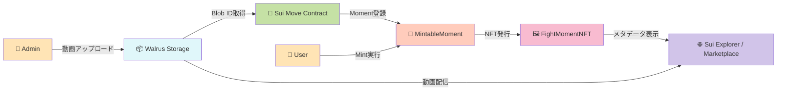

# 🥊 Fight Moments NFT

> 格闘技の決定的瞬間を、永続的なデジタル資産として所有する

[](https://sui.io/)
[](https://docs.walrus.site/)
[](https://nextjs.org/)
[](https://www.typescriptlang.org/)
[](https://opensource.org/licenses/MIT)

**🏆 Sui × ONE Championship Hackathon Submission**

---

## 📺 デモ

<!-- デモ動画を撮影後、以下のコメントを外してYouTube/LoomのURLを記載してください -->
<!--
[](https://youtu.be/YOUR_VIDEO_ID)

📺 **[デモ動画を見る](https://youtu.be/YOUR_VIDEO_ID)** - 1分30秒のウォークスルー
-->

🌐 **ライブデモ**: [YOUR_DEPLOY_URL_HERE]
📦 **Smart Contract**: [View on Suiscan](https://suiscan.xyz/testnet/object/0xcb62132563f5a2a606950ae6417665d80fb06048bb2eb832618b5ee0376f4401)

---

## 🌟 プロジェクトハイライト

### 💰 解決する課題

格闘技ファンは「**あの瞬間**」を再視聴するために配信サービスを契約し続けます。
しかし、そのコンテンツは**プラットフォームに閉じており、ファンは所有できません**。

- ❌ 配信プラットフォームに動画が閉じ込められている
- ❌ 選手や主催団体への二次的収益還元が不十分
- ❌ ファンが「自分が見たあの瞬間」を公式に所有できない

### 🎯 Fight Moments NFTの解決策

**決定的瞬間を、永続的なデジタル資産として所有可能に**

| 特徴 | 説明 |
|------|------|
| 🎬 **Walrus分散ストレージ** | 動画を永続的に保存、中央サーバーに依存しない |
| ⛓️ **Sui所有権証明** | ブロックチェーンで所有権を透明に管理 |
| 🎫 **限定発行 + シリアル番号** | オンチェーンSupply管理で希少価値を担保 |
| 💸 **二次流通対応** | Marketplaceでファン間の取引が可能 |

### ⚡ 技術的革新性

- ✅ **Walrus × Sui統合**: 動画NFTの実用的実装を実現
- ✅ **Supply管理**: オンチェーン希少性制御（max_supply設定）
- ✅ **Display最適化**: Sui Explorer完全対応（HTTPS URL修正済み）
- ✅ **Admin権限制御**: AdminCapによる品質保証された登録フロー

---

## 📸 スクリーンショット

<!-- スクリーンショットを撮影後、以下のコメントを外してください -->
<!-- docs/screenshots/ に画像を配置済みの場合は、このセクションのコメントを外してください -->

<!--
### Landing Page


### Mint画面


### NFT詳細（Walrus動画再生）


### Marketplace

-->

> 📸 **スクリーンショット撮影ガイド**: [`docs/screenshots/README.md`](./docs/screenshots/README.md)

---

## 🏗️ システムアーキテクチャ



### コア設計原則

- **分離責任**: ストレージ（Walrus） / 所有権（Sui） / UI（Next.js）
- **Admin権限制御**: AdminCapによる公式Moment登録制限
- **Supply管理**: max_supply制約による希少性保証
- **永続性**: Walrus分散ストレージで動画データを永久保存

---

## 🛠️ 技術スタック

### Blockchain & Storage
| 技術 | 用途 | バージョン |
|------|------|-----------|
| **Sui Move** | スマートコントラクト | 2024.beta edition |
| **Walrus** | 分散動画ストレージ | Testnet |
| **@mysten/dapp-kit** | Sui Wallet統合 | Latest |

### Frontend
| 技術 | 用途 | バージョン |
|------|------|-----------|
| **Next.js** | フロントエンドフレームワーク | 16.x (App Router) |
| **React** | UIライブラリ | 19.x |
| **TypeScript** | 型安全性 | 5.x |
| **Tailwind CSS** | スタイリング | v4 |
| **Biome** | Lint/Format | Latest |

---

## ✨ 主要機能

### 1. 🎬 Moment登録（Admin専用）

**管理者が格闘技の名シーンを登録**

- 動画ファイルをWalrusへアップロード
- Blob IDを取得してMove Contractへ登録
- Moment情報設定（タイトル、説明、最大発行数）

```typescript
// Adminのみ実行可能（AdminCap保有者）
register_mintable_moment(
  admin_cap: &AdminCap,
  title: String,
  description: String,
  media_url: String,  // Walrus Blob URL
  max_supply: u64,    // 最大発行数
  ctx: &mut TxContext
)
```

### 2. 🎫 NFT Mint（ユーザー）

**ファンが限定NFTをMint**

- 登録されたMoment一覧から選択
- Mintボタンクリックでトランザクション実行
- シリアルナンバー付きNFT取得（例: #3/10）

```typescript
// 誰でもMint可能（Supply上限まで）
mint_moment(
  mintable: &mut MintableMoment,
  payment: Coin<SUI>,
  ctx: &mut TxContext
): FightMomentNFT
```

### 3. 📊 Supply管理

**オンチェーン希少性制御**

- 各Momentに最大発行数（max_supply）を設定
- 現在のMint数をトラッキング
- 上限到達後はMint不可（フロントでも表示）

### 4. 🔄 Marketplace

**NFTの二次流通**

- 発行済みNFT一覧表示
- Sui Kiosk経由での取引
- Transfer Policy適用（ロイヤリティ設定済み）

---

## 🚀 デプロイ情報

### Sui Testnet

| 項目 | 値 |
|------|-----|
| **Network** | Sui Testnet |
| **Package ID** | `0xcb62132563f5a2a606950ae6417665d80fb06048bb2eb832618b5ee0376f4401` |
| **Transfer Policy** | `0x5a9a3cf651d84104178b2d3ebc415d7f9c9d249d9969f083a2e3da88b17fe3a7` |
| **Admin Cap** | `0x97bb2c72fc4fda471b84dd606fa38534a3f017f28a5b1525017a9ff0e0d70b83` |
| **Collection ID** | `fight-moments-v1` |

### Walrus Testnet

| 項目 | 値 |
|------|-----|
| **Publisher URL** | `https://publisher.walrus-testnet.walrus.space` |
| **Aggregator URL** | `https://aggregator.walrus-testnet.walrus.space` |

### Frontend Deployment

- **Platform**: [Vercel / Netlify / その他]
- **URL**: [YOUR_DEPLOY_URL_HERE]

---

## 💡 技術的チャレンジと解決策

### 1. 🎥 動画の永続化問題

**課題**: 中央集権的ストレージ（AWS S3, YouTube等）への依存

**解決策**:
- Walrus分散ストレージへの統合実装
- Blob IDをオンチェーンで管理
- Walrus Aggregator経由で動画配信

```typescript
// Walrus Blob URL形式
https://aggregator.walrus-testnet.walrus.space/v1/{blob_id}
```

### 2. 🖼️ NFTメタデータの柔軟性

**課題**: Sui ExplorerでのNFT表示URL形式問題

**解決策**:
- Display設定でHTTPS URLを指定
- image_url/media_url両方に対応
- 最近のコミットで修正完了（`b0d61a7`）

```move
// Display設定（Move Contract）
display.add(b"image_url", b"https://aggregator.walrus-testnet.walrus.space/v1/{media_url}");
```

### 3. ⚙️ Supply管理の信頼性

**課題**: NFT発行数の上限制御をオンチェーンで実現

**解決策**:
- MintableMoment構造体でcurrent_supply/max_supplyを管理
- Mint時にassert!で上限チェック
- フロントエンドでも進捗表示（5/10 Mintedなど）

---

## 📦 ローカル実行方法

### 前提条件

- Node.js 20+ または Bun
- Sui CLI（Smart Contract開発用）
- Sui Wallet（Chrome拡張）

### セットアップ（3ステップ）

#### 1️⃣ リポジトリクローン

```bash
git clone https://github.com/YOUR_USERNAME/fight_moments.git
cd fight_moments
```

#### 2️⃣ 環境変数設定

```bash
cd frontend
cp .env.example .env
```

`.env`ファイルを編集して、デプロイ済みのContract情報を記載:

```bash
NEXT_PUBLIC_PACKAGE_ID=0xcb62...  # あなたのPackage ID
NEXT_PUBLIC_ADMIN_CAP_ID=0x97bb...  # Admin Cap ID
# その他の環境変数も設定
```

> 📄 詳細は [`frontend/.env.example`](./frontend/.env.example) を参照

#### 3️⃣ 起動

```bash
# 依存関係インストール
bun install  # または npm install

# 開発サーバー起動
bun dev  # または npm run dev
```

ブラウザで http://localhost:3000 を開く

---

## 🏆 Sui × ONE Championship ハッカソンへの適合性

### ONE Championshipとの完璧な親和性

本プロジェクトは、**格闘技エンターテインメントとブロックチェーンの融合**を実現します。

| ONE Championshipの価値 | Fight Moments NFTで実現 |
|------------------------|------------------------|
| 🌏 **グローバルファンベース** | 世界中のファンが同じNFTを所有・取引 |
| ⚡ **瞬間のドラマ** | KO・一本などの決定的瞬間を永続化 |
| 🎖️ **アスリート価値の最大化** | 選手の名シーンがファン資産として流通 |
| 📈 **新しい収益モデル** | 二次流通ロイヤリティで継続的収益 |

### Sui Networkの技術優位性

| Sui特性 | 本プロジェクトでの活用 |
|---------|----------------------|
| ⚡ **高速トランザクション** | Mint処理が即座に完了 |
| 💰 **低コスト** | ファンが気軽にMint可能 |
| 🎨 **豊富なDisplay機能** | NFTメタデータの柔軟な表示 |
| 🔧 **Move言語の安全性** | Supply制御やAdmin権限を厳密に実装 |

### ハッカソンテーマ該当性

- ✅ **DeFi/NFT活用**: NFT Marketplace + ロイヤリティ分配
- ✅ **Infrastructure**: Walrus分散ストレージ統合
- ✅ **Gaming/Entertainment**: スポーツエンタメ × ファンエンゲージメント
- ✅ **Sui技術の最大活用**: Move 2024.beta + Display + Kiosk

---

## 🎬 デモ動画撮影について

> 📹 **撮影台本**: [`docs/DEMO_SCRIPT.md`](./docs/DEMO_SCRIPT.md)

デモ動画を作成される場合は、上記の台本を参考にしてください。
推奨時間: **1分30秒**

---

## 📁 リポジトリ構成

```
fight_moments/
├── contracts/              # Sui Move スマートコントラクト
│   ├── sources/
│   │   └── contracts.move  # FightMomentNFT, MintableMoment定義
│   ├── Move.toml
│   └── Move.lock
├── frontend/               # Next.js フロントエンド
│   ├── src/
│   │   ├── app/           # App Router（pages）
│   │   ├── components/    # React Components
│   │   ├── lib/           # Utilities, Constants
│   │   └── hooks/         # Custom Hooks
│   ├── public/
│   ├── package.json
│   ├── .env.example       # 環境変数サンプル
│   └── biome.json         # Linter設定
├── docs/                  # ドキュメント
│   ├── screenshots/       # スクリーンショット用
│   │   └── README.md      # 撮影ガイド
│   └── DEMO_SCRIPT.md     # デモ動画台本
└── README.md              # 本ドキュメント
```

---

## 🛣️ ロードマップ

### ✅ Phase 1: MVP（完了）

- [x] Sui Move Contract実装（NFT + Supply管理）
- [x] Walrus統合（動画アップロード＆配信）
- [x] Admin登録UI
- [x] User Mint UI
- [x] Marketplace基本機能
- [x] Sui Testnetデプロイ

### 🚧 Phase 2: Enhancement（実装中）

- [ ] フロントエンドデプロイ（Vercel）
- [ ] スクリーンショット撮影
- [ ] デモ動画作成
- [ ] UI/UXブラッシュアップ

### 🔮 Phase 3: Future（構想）

- [ ] ONE Championship公式コンテンツ連携
- [ ] 投票機能（ファンが選ぶベストモーメント）
- [ ] ロイヤリティ自動分配
- [ ] クロスチェーン対応（他チェーンへのブリッジ）
- [ ] モバイルアプリ

---

## 🤝 コントリビューション

現在はハッカソン提出版のため、コントリビューションは受け付けておりません。
プロジェクトへのフィードバックは [Issues](../../issues) までお願いします。

---

## 📄 ライセンス

MIT License - 詳細は [LICENSE](./LICENSE) を参照

---

## 🙏 謝辞

- **Sui Foundation** - 高速で安全なブロックチェーンインフラ
- **Walrus Team** - 分散ストレージソリューション
- **ONE Championship** - 格闘技エンターテインメントの革新
- **ハッカソン運営チーム** - 素晴らしい機会の提供

---

## 📞 コンタクト

プロジェクトに関するお問い合わせ:
- GitHub Issues: [こちら](../../issues)
- X (Twitter): [@YOUR_HANDLE]  <!-- 必要に応じて記載 -->

---

<div align="center">

**🥊 Fight Moments NFT - Own the Moment, Forever 🥊**

Made with ❤️ for Sui × ONE Championship Hackathon

</div>
